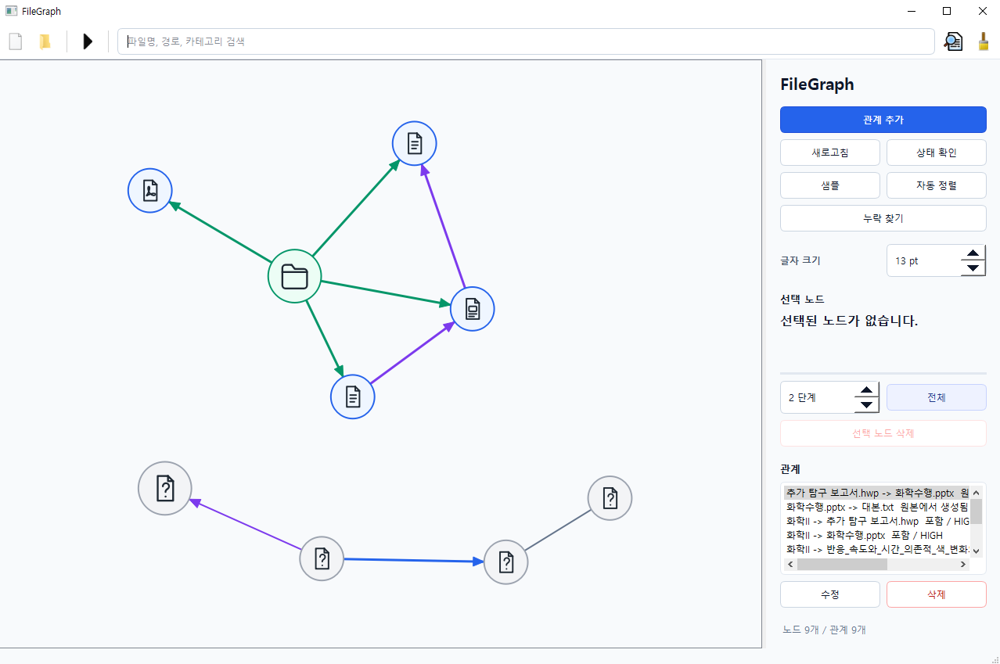
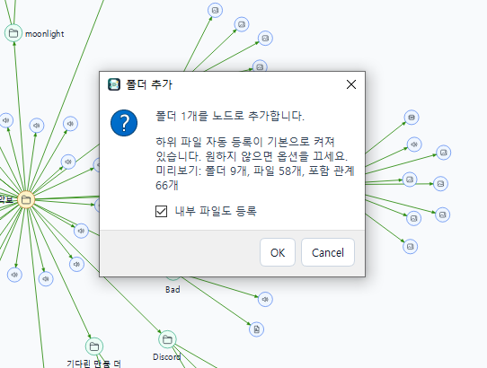
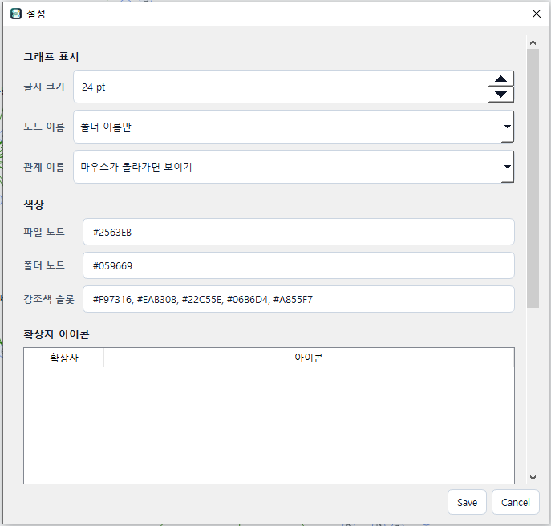
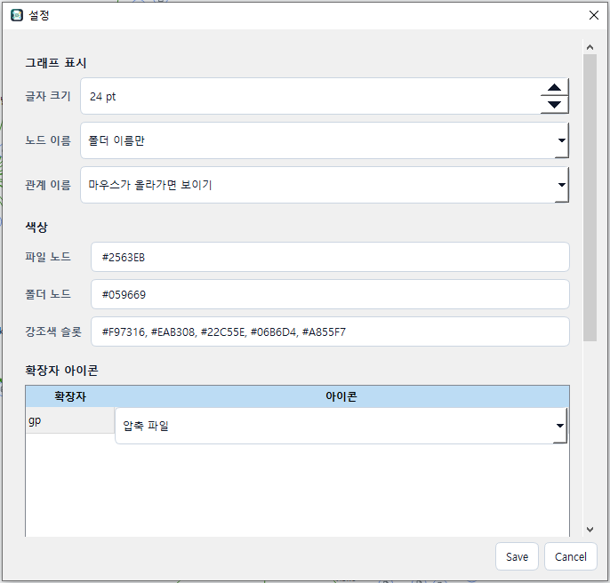
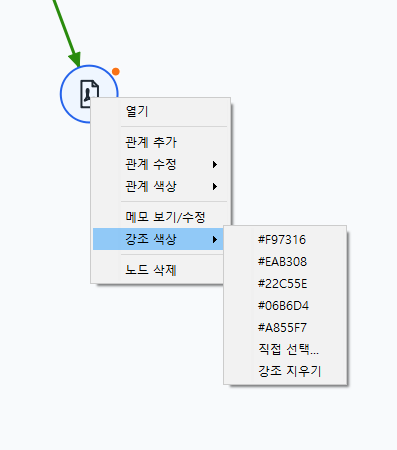

# FileGraph

FileGraph는 파일 시스템의 물리적인 폴더 구조와 별개로 파일과 폴더 사이의 논리적 관계를 저장하고 시각화하는 Windows 데스크톱 앱입니다.

파일을 어디에 넣어두었는지보다 "이 파일이 무엇과 연결되어 있는지"를 중심으로 관리합니다. 사용자는 파일과 폴더를 노드로 등록하고, 노드 사이에 관계 타입, 방향성, 강도, 설명을 가진 간선을 만들 수 있습니다.

## 다운로드

Windows 사용자는 [GitHub Releases](https://github.com/Cotran03/FileGraph/releases)에서 `FileGraph-v0.1.0-windows-x64.zip`을 다운로드합니다.

압축을 푼 뒤 `FileGraph.exe`를 실행하면 됩니다. GitHub가 자동으로 제공하는 `Source code (zip)`은 개발자용 소스 코드이며, 일반 실행용 배포 파일이 아닙니다.

## 화면

| 화면 | 설명 |
| --- | --- |
|  | 메인 그래프와 오른쪽 작업 패널입니다. 등록된 파일/폴더 노드, 포함 관계, 선택 노드 정보와 관계 목록을 함께 확인할 수 있습니다. |
|  | 폴더 추가 전 미리보기입니다. 하위 파일 자동 등록 여부와 등록될 폴더, 파일, 포함 관계 개수를 확인합니다. |
|  | 설정 화면입니다. 라벨 표시 방식, 글자 크기, 노드 색상, 강조 색상, 확장자 아이콘 설정을 관리합니다. |
|  | 확장자 아이콘 매핑입니다. 사용자가 특정 확장자에 원하는 아이콘 분류를 직접 지정할 수 있습니다. |
|  | 노드 우클릭 메뉴입니다. 열기, 관계 추가/수정/삭제, 메모, 강조 색상, 노드 삭제 같은 작업을 바로 실행합니다. |

## 핵심 아이디어

- 파일과 폴더를 그래프의 `Nodes`로 관리한다.
- 파일-파일, 파일-폴더, 폴더-폴더 사이의 논리적 연결을 `Relations`로 저장한다.
- 관계 강도와 관계 타입 색상에 따라 그래프 배치와 간선 표현을 다르게 보여준다.
- 노드는 폴더, 파일 확장자, 누락/권한 상태, 강조 색상에 맞게 구분한다.
- 사용자가 드래그한 노드 위치는 저장되어 다음 실행 때도 유지된다.
- 파일이 사라지거나 접근할 수 없어도 관계 기록은 바로 지우지 않고 상태값으로 보존한다.

## 구현된 기능

수동 그래프 관리 MVP와 최근 UX 보강은 구현 완료 상태입니다.

- 파일과 폴더를 노드로 등록한다.
- 앱은 한 번에 하나의 프로세스만 실행하며, 실행 중 다시 열면 추가 프로세스는 즉시 종료한다.
- 파일/폴더 드래그 앤 드롭 등록을 지원한다.
- 폴더 등록 시 하위 파일 자동 등록이 기본으로 켜져 있으며, 추가 전에 등록될 파일/폴더/포함 관계 개수를 미리 보여준다.
- 폴더-하위 폴더-파일 계층에 맞춰 `포함(CONTAINS)` 관계를 자동 생성한다.
- 서로 다른 경로가 동일한 실제 파일을 가리키는 하드 링크이면 각 경로를 별도 노드로 등록하고 `같은 파일(SAME_FILE)` 관계를 자동 생성한다.
- 관계 타입, 방향성, 강도, 설명을 가진 관계를 추가/수정/삭제한다.
- 그래프에서 노드를 드래그해 배치하고 좌표를 저장한다.
- 파일 확장자, 폴더, 누락, 접근 거부 상태별 SVG 아이콘을 표시한다.
- 설정 화면에서 확장자별 아이콘 매핑을 직접 추가/수정/삭제할 수 있다.
- 폴더 노드의 내부 파일 노드를 우클릭 메뉴에서 접거나 펼칠 수 있다.
- 접힌 폴더와 최상위 폴더를 시각적으로 구분한다.
- 검색, 검색 제안, 선택 노드 기준 포커스 뷰, 전체 보기, 자동 정렬을 제공한다.
- 작업 패널의 보기 프리셋으로 `누락 파일만`, `강조 노드 주변`, `최근 추가`, `선택 폴더 아래`, `고립 노드` 보기를 빠르게 적용한다.
- 작은 창 높이에서는 작업 패널 내용을 내부 스크롤로 접근할 수 있다.
- 노드 라벨은 `폴더 이름만`, `파일 이름만`, `둘 다`, `마우스가 올라가면 보이기`로 설정할 수 있다. 타입별로 기본 표시되지 않는 라벨도 마우스를 올리면 표시된다.
- 별도 설정 화면에서 라벨 표시 방식, 글자 크기, 무시 폴더, 노드 색상, 강조 색상 슬롯, 확장자 아이콘을 관리한다.
- 설정 화면의 색상 선택기, 색상 칩 미리보기, 기본 색상 초기화로 파일/폴더/강조 슬롯 색상 설정을 확인할 수 있다.
- 무시 폴더로 지정한 이름은 하위 순회뿐 아니라 해당 폴더를 직접 추가하거나 드래그한 경우에도 건너뛴다.
- 우클릭 메뉴에서 열기, 관계 추가/수정, 폴더 접기/펼치기, 강조, 메모, 관계 색상, 삭제 작업을 수행한다.
- 메모가 있는 노드는 우상단 표시로 구분하고, 선택 패널에서 메모 요약을 보여준다.
- `Ctrl+A`로 현재 그래프에 보이는 노드를 모두 선택하고, 컨트롤 패널에서 선택 노드를 일괄 삭제할 수 있다.
- `Ctrl+Z`로 노드 삭제, 관계 삭제, 자동 정렬 같은 그래프 작업을 되돌릴 수 있다.
- 노드 더블클릭으로 원본 파일 또는 폴더를 연다.
- 노드 삭제는 원본 파일을 지우지 않고 FileGraph 안에서만 숨기는 soft delete로 처리한다.
- `파일 위치 갱신`으로 `ACTIVE`, `MISSING`, `ACCESS_DENIED` 상태를 반영한다.
- 활성 파일의 SHA-256 해시를 저장하고, 선택한 폴더 안에서 해시 기반 누락 파일 복구를 수행한다.
- 폴더 대량 추가, 파일 위치 갱신, 누락 파일 찾기에서 진행 상태를 보여주고 취소할 수 있다.
- DB 백업, DB 가져오기, 작업 패널의 JSON/CSV 내보내기, 고립 노드 보기, 중복 후보 확인을 제공한다.

## 현재 한계

아직 구현 전인 큰 기능은 사용자 지정 관계 타입 관리 화면, 실제 파일 이동 자동화, 이동 Undo입니다. 빌드된 실행 파일 기준 QA와 대규모 데이터 성능 검증도 계속 확인 대상입니다.

## 목표 사용자

FileGraph는 폴더 정리 규칙보다 파일 사이의 의미 관계가 더 중요한 사람을 위한 도구입니다.

- 프로젝트 파일이 여러 폴더에 흩어져 있어 맥락을 잃기 쉬운 경우
- 기획서, 발표자료, 예산표, 디자인 소스처럼 서로 참조하는 파일을 함께 보고 싶은 경우
- 물리적 폴더 구조를 자주 바꾸지 않고도 파일 관계를 기록하고 싶은 경우
- 수동으로 안전하게 관계 데이터를 쌓고 싶은 경우

## 문서

- [USAGE.md](./doc/USAGE.md): 실행 방법과 사용 흐름
- [SPEC.md](./doc/SPEC.md): 구현 사양, 기술 스택, DB 구조, 정책 결정
- [NEW_IDEA.md](./doc/NEW_IDEA.md): 파일 관계·출처·의존성 추적기로 확장하는 제품 방향
- [RELEASE_CHECKLIST.md](./RELEASE_CHECKLIST.md): AI 없는 첫 릴리즈 후보 검증 체크리스트
- [config/README.md](./config/README.md): 로컬 설정과 비밀값 저장 정책
- [requirements.txt](./requirements.txt): Python 의존성 목록

## 개발 방향

1차 목표는 수동 파일 관계 그래프입니다. 이 범위는 현재 충족된 상태입니다.

다음 단계는 사용자 지정 관계 타입 관리, 더 정교한 파일 이동 추적, 대규모 데이터 기준 QA입니다.
